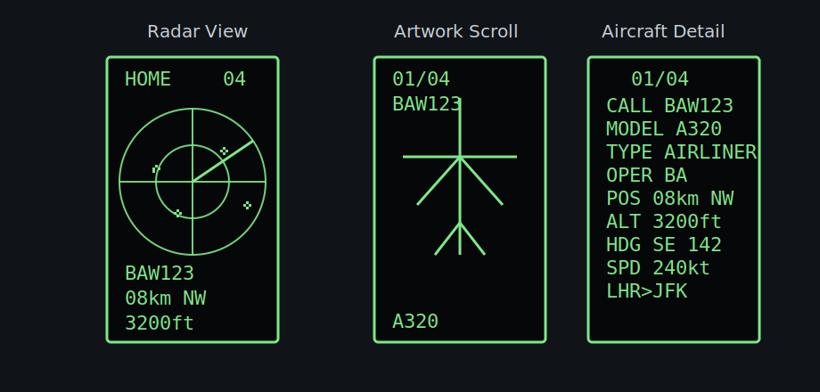

# Heltec Air Radar

Animated aircraft radar for the Heltec WiFi LoRa 32 / HTIT-WB32 ESP32 board with the built-in 128x64 OLED.

The sketch connects to WiFi, fetches nearby aircraft from the public ADS-B API at `api.adsb.lol`, and displays a small old-radar-style sweep. Aircraft positions are projected locally between network updates so the display keeps moving even when the API is slow.



The radar screen shows aircraft count, a sweep, nearby targets, and the nearest aircraft summary. The detail screen is opened with the `PRG` button and shows one aircraft at a time with aircraft art, model, type, operator, position, altitude, heading, speed, and route when enrichment data is available.

## Features

- Portrait OLED radar display
- Nearby aircraft plotted around a configurable home location
- Local motion projection from aircraft speed and heading
- Background FreeRTOS fetch task in the Arduino C++ version
- `PRG` button support:
  - short press: open/cycle aircraft detail pages
  - long press: return to radar
- Battery voltage reading on `GPIO37`
- Aircraft detail enrichment from ADSBDB for model, operator, and origin/destination when available
- Multiple aircraft art families: helicopter, prop, twin prop, business jet, airliner, heavy jet, cargo, military, glider, and fallback
- Sanitized MicroPython prototype included for reference

## Hardware

Tested target:

- Heltec WiFi LoRa 32 / HTIT-WB32 ESP32 board
- Built-in SSD1306-compatible `128x64` OLED
- CP210x USB serial bridge

Pins used by default:

| Function | Pin |
| --- | --- |
| OLED SDA | `GPIO4` |
| OLED SCL | `GPIO15` |
| OLED reset | `GPIO16` |
| Program button | `GPIO0` |
| Battery ADC | `GPIO37` |

## Configure

Before flashing, edit these values in `arduino-radar/arduino-radar.ino`:

```cpp
const char* WIFI_SSID = "YOUR_WIFI_SSID";
const char* WIFI_PASSWORD = "YOUR_WIFI_PASSWORD";

constexpr double HOME_LAT = 51.500000;
constexpr double HOME_LON = -0.120000;
const char* HOME_PLACE = "HOME";
```

Use approximate coordinates if you plan to publish your fork. Do not commit your WiFi password or precise home location.

## Build And Upload

Install:

- Arduino CLI or Arduino IDE
- ESP32 board package
- `Adafruit SSD1306`
- `Adafruit GFX Library`
- `ArduinoJson`

Using Arduino CLI:

```powershell
arduino-cli core install esp32:esp32
arduino-cli lib install "Adafruit SSD1306" "Adafruit GFX Library" "ArduinoJson"
arduino-cli compile --fqbn esp32:esp32:heltec_wifi_lora_32 arduino-radar
arduino-cli upload -p COM8 --fqbn esp32:esp32:heltec_wifi_lora_32 arduino-radar
```

If upload fails to enter the bootloader automatically, hold `PRG`, tap reset, then release `PRG` once upload starts.

## Data Source

Aircraft data comes from:

- `https://api.adsb.lol/v2/point/{lat}/{lon}/{radius_nm}`

Optional aircraft detail enrichment comes from:

- `https://api.adsbdb.com/v0/callsign/{callsign}`
- `https://api.adsbdb.com/v0/aircraft/{hex}`

This is a public service. Keep the refresh interval polite. The default is `30` seconds.

## Privacy

This repository intentionally contains placeholder WiFi credentials and approximate example coordinates only. Check your changes before publishing:

```powershell
git grep -n "YOUR_WIFI\\|HOME_LAT\\|HOME_LON"
```

## Prototype

The `micropython-prototype/` folder contains the earlier MicroPython version. The Arduino C++ version is recommended because it keeps display animation separate from the network fetch task.
